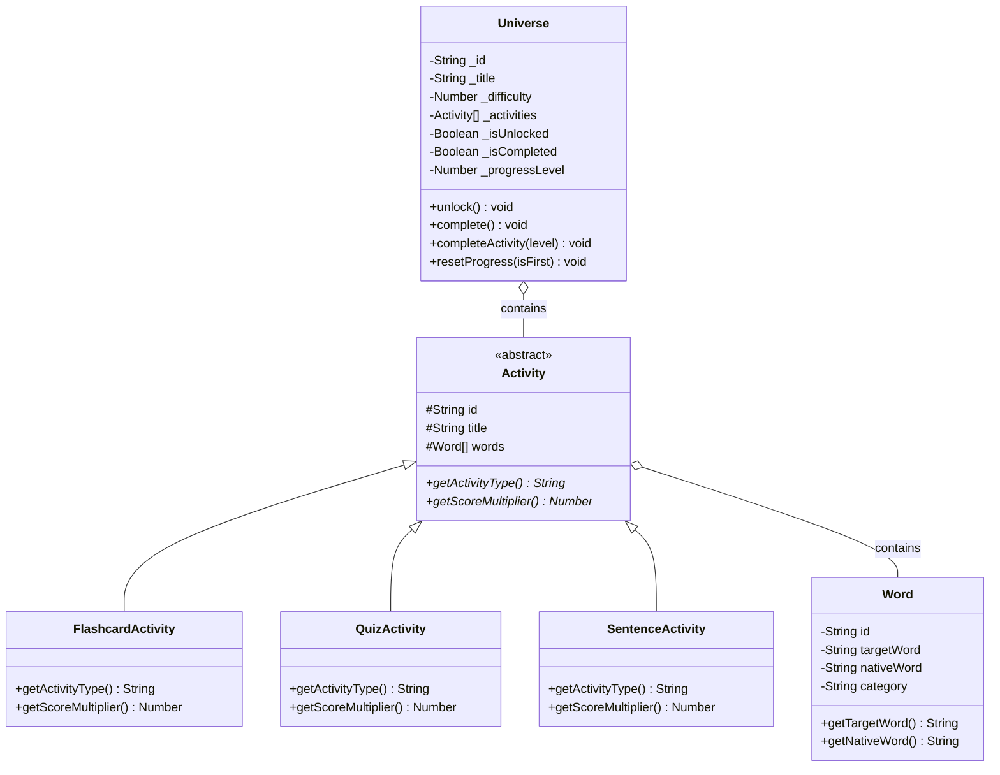

# UML Diyagramları

Bu dosyayı görselleştirmek için içerikteki kod bloklarını **mermaid.live** veya herhangi bir Markdown görüntüleyici programda çalıştırabilirsiniz.

## 1. Sınıf Diyagramı (Class Diagram)



## 2. Kullanım Senaryosu (Use Case Diagram)

```mermaid
usecaseDiagram
    actor "Oyuncu (Öğrenci)" as User
    
    rectangle RouteLingo {
        usecase "Oyuna Giriş Yap (Ad-Soyad)" as UC1
        usecase "Haritayı Görüntüle" as UC2
        usecase "Evren Seçimi Yap" as UC3
        usecase "Kelime Kartlarını Çalış" as UC4
        usecase "Quiz Çöz" as UC5
        usecase "Cümle Kur" as UC6
        usecase "XP ve Can Durumunu Takip Et" as UC7
        usecase "Profil Panelinden Çıkış Yap" as UC8
        usecase "Can Kaybetme / Bekleme" as UC9
    }
    
    User --> UC1
    User --> UC2
    User --> UC7
    User --> UC8
    
    UC2 --> UC3 : extends
    UC3 --> UC4 : includes
    UC4 --> UC5 : unlocks
    UC5 --> UC6 : unlocks
    UC5 --> UC9 : yanlış cevap (extends)
    UC6 --> UC9 : yanlış cevap (extends)
```
